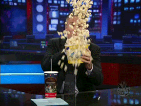

# PopcornEditText

An `EditText` that keep popping text. Requirement: `minSDK: 16`

 

## Usage
### 1. Setup with gradle
Add `compile 'io.github.kexanie.library:PopcornEditText:0.0.1'` to your module's `build.gradle` file.
```
dependencies {
    compile 'io.github.kexanie.library:PopcornEditText:0.0.1'
}
```

### 2. Define `PopcornEditText` in your layout file
```
<io.github.kexanie.library.PopcornEditText
    android:layout_width="match_parent"
    android:layout_height="wrap_content"
    app:endY="0dp"
    app:TTL="7000"
    app:popcorn_size="12sp"
    app:popcorn_color="@android:color/black"
    />
```

**Caution**
You should add `android:windowSoftInputMode="adjustResize"` to your activity in the manifest, otherwise the characters will fall behind the keyboard. For example: 
```
<activity android:name=".MainActivity"
    android:windowSoftInputMode="adjustResize">
    <intent-filter>
        <action android:name="android.intent.action.MAIN" />

        <category android:name="android.intent.category.LAUNCHER" />
    </intent-filter>
</activity>
```

#### Attributes
|Attribute | Type | Description |
|----------|------|--------------|
|endY|dimension|The highest position that a character can jump to. Relative to the top edge of root view.|
|TTL|int|The time(ms) that a popped out characters exist.|
|popcorn_size|dimension|The `textSize` of popped out characters.|
|popcorn_color|color|The color of popped out characters.|

## Feedback
Please dont hesitate to create an issue ticket or pull request.



## Thanks
Inspired by [`BiuEditText`][BiuEditText] and this gif.


Thanks [Jawnnypoo][Jawnnypoo] and his [PhysicsLayout][PhysicsLayout].

[BiuEditText]: https://github.com/xujinyang/BiuEditText
[Jawnnypoo]: https://github.com/Jawnnypoo
[PhysicsLayout]: https://github.com/Jawnnypoo/PhysicsLayout